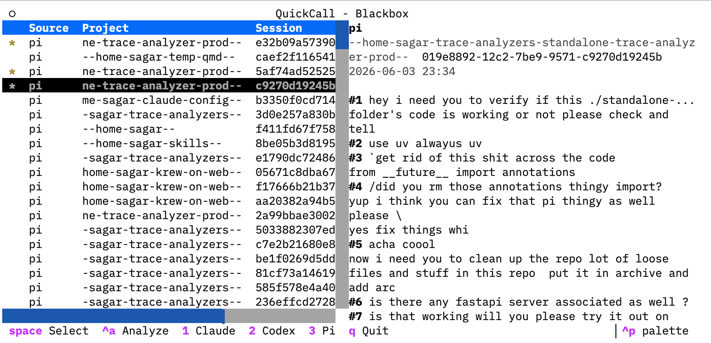
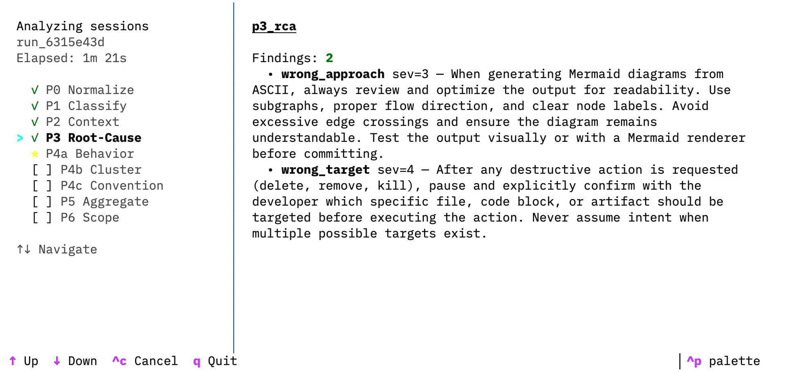
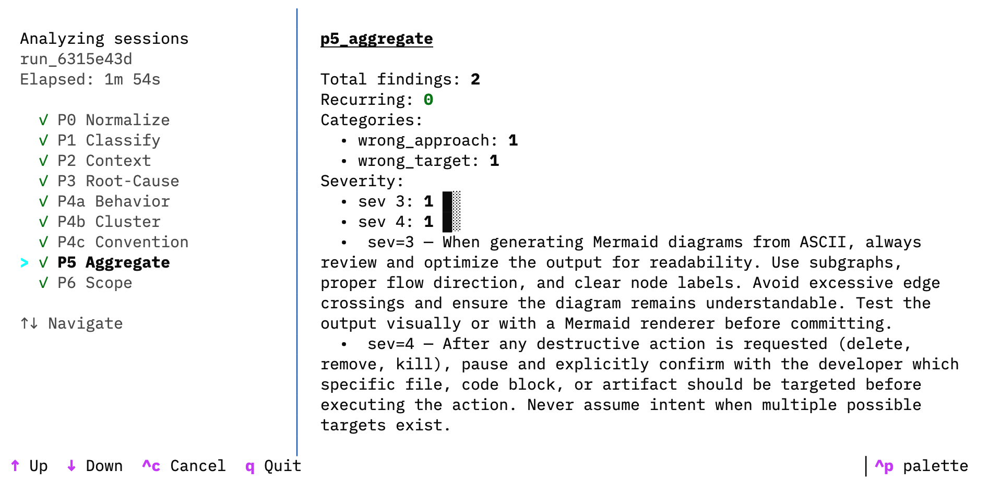
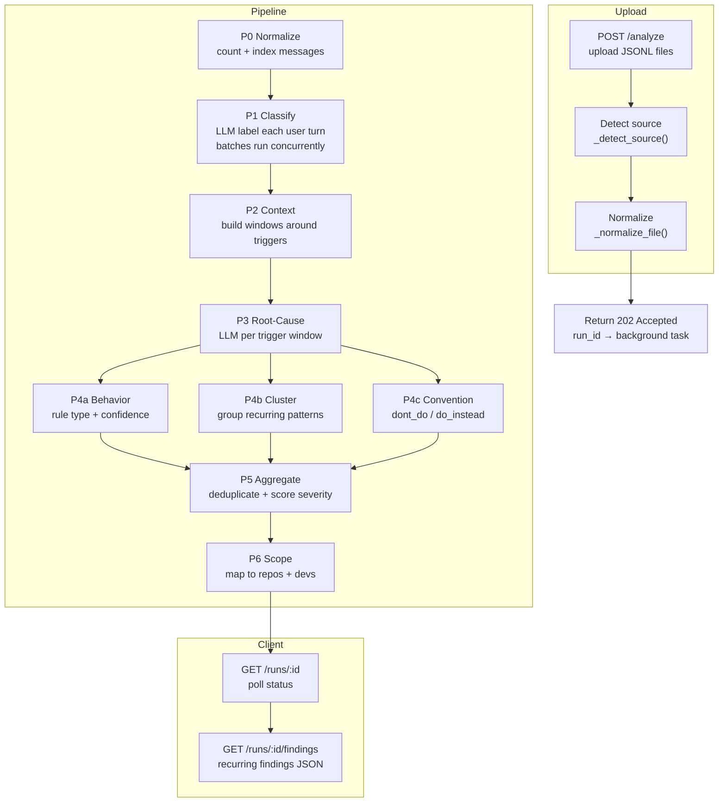

# Blackbox

Analysis engine for AI coding session traces. Ingests JSONL logs from Claude Code, Codex CLI, or pi.dev, runs a 9-stage LLM pipeline, and surfaces root causes, recurring failures, and anti-patterns.

## Demo

<p align="center">
  <b>Session browser</b><br/>
  
</p>

<p align="center">
  <b>Splash screen</b><br/>
  
</p>

<p align="center">
  <b>Live progress</b><br/>
  
</p>

## What it does

- **Multi-source ingestion** — accepts traces from Claude Code, Codex CLI, pi.dev, and more
- **9-stage LLM pipeline** — classifies, analyzes root causes, clusters patterns, scores severity
- **Disk persistence + resume** — stage outputs saved to disk; server restart picks up where it left off
- **DeepSeek V4 Pro support** — json_object response format, retry logic, structured logging

## How it works



## Quick Start

```bash
cp .env.example .env
# edit .env and add your OPENAI_API_KEY

uv run uvicorn src.main:app --host 0.0.0.0 --port 8000
uv run quickcall  # Launch TUI (connects to http://localhost:8000)
```

The API binds to `0.0.0.0` (all interfaces). The CLI defaults to `localhost:8000`. If the API is running on a different host or port, set `BLACKBOX_API_URL` before launching the TUI:

```bash
export BLACKBOX_API_URL=http://192.168.1.42:8000
uv run quickcall
```

## Features

- Multi-source session analysis (Claude, Codex, pi, Gemini, Cursor)
- 9-stage LLM pipeline with live progress
- Disk persistence + resume
- DeepSeek V4 Pro support
- 80 tests

## Docs

- [API Reference](docs/api.md)
- [CLI Guide](docs/cli.md)
- [Pipeline](docs/pipeline.md)
- [Configuration](docs/configuration.md)
- [Architecture](docs/architecture.md)
- [Agent Guide](AGENTS.md)

## License

Apache 2.0 — see [LICENSE](LICENSE).
