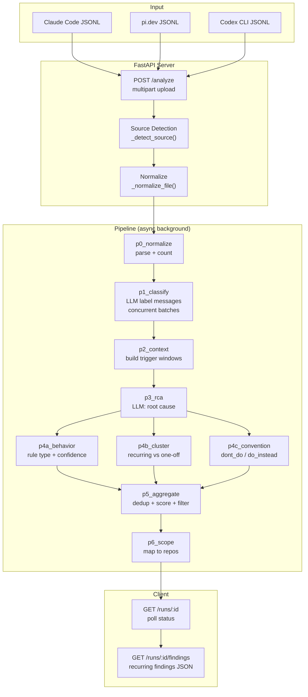

# Architecture

## Overview

Blackbox is a FastAPI server that ingests AI coding session logs (JSONL), normalizes them to a unified format, runs a multi-stage LLM analysis pipeline, and returns root-cause findings.



## File Structure

```
src/
├── main.py                    # FastAPI app, routes, file upload handling
├── config.py                  # Settings from env (.env)
├── models.py                  # Pydantic response models
│
├── pipeline/                  # Analysis pipeline
│   ├── __init__.py            # Re-exports all pipeline symbols
│   ├── orchestrator.py        # Pipeline class — P0–P6 stages
│   ├── annotator.py           # Message annotation (tool calls, edits)
│   ├── context_builder.py     # Context window extraction
│   └── dedup.py               # Finding deduplication
│
├── classify/                  # Message classification
│   ├── __init__.py
│   ├── prompts.py             # LLM prompts + schemas
│   └── runner.py              # Classification runner + skeletons
│
├── rca/                       # Root-cause analysis
│   ├── __init__.py
│   └── prompts.py             # RCA + behavior + cluster + convention prompts
│
├── normalizer/                # Source format normalizers
│   ├── __init__.py
│   ├── unified.py             # NormalizedMessage, TokenUsage, ToolCall, ToolResult
│   ├── claude_code_transform.py
│   ├── codex_cli_transform.py
│   ├── pi_transform.py
│   ├── gemini_cli_transform.py
│   ├── cursor_transform.py
│   ├── cursor_v1.py
│   ├── cursor_v2.py
│   ├── cursor_vscdb_transform.py
│   └── vscdb_reader.py
│
├── llm/
│   ├── __init__.py
│   └── client.py              # AsyncLLMClient (OpenAI-compatible)
│
└── storage/
    ├── __init__.py
    └── run_store.py           # In-memory run state storage

tests/
├── conftest.py
├── test_api.py                # HTTP route tests
├── test_pipeline.py           # Pipeline orchestration tests
├── test_annotator.py
├── test_classify.py
├── test_context.py
├── test_normalizer.py
├── test_rca_prompts.py
└── test_run_store.py
```

## Data Flow

1. **Upload** — Client POSTs one or more `.jsonl` files via multipart form
2. **Detect** — `_detect_source()` identifies format by filename + content heuristics
3. **Normalize** — Source-specific normalizer produces `NormalizedMessage` list
4. **Pipeline** runs as background task:
   - **p0** — Counts messages per session
   - **p1** — Classifies each user message (question, new_task, correction, etc.)
   - **p2** — Builds context windows around trigger turns
   - **p3** — LLM root-cause analysis on each trigger
   - **p4a** — Classifies findings by rule type (behavior)
   - **p4b** — Clusters recurring findings into patterns
   - **p4c** — Identifies wrong_approach conventions
   - **p5** — Deduplicates, scores severity, filters to recurring
   - **p6** — Maps findings to repos/developers
5. **Poll** — Client polls `GET /runs/{run_id}` until status is `"done"`
6. **Fetch** — Client gets findings from `GET /runs/{run_id}/findings`

## Source Detection

Auto-detects format from filename + first 512 bytes of content:

| Source | Filename markers | Content markers |
|--------|-----------------|-----------------|
| Claude Code | `claude` in name | `"uuid"` + `"version"` or `"gitBranch"` |
| pi.dev | `.pi` or `pi-` in name | `"type":"session"` or `"type":"message"` |
| Codex CLI | `codex` in name | rollout filename pattern |

## Disk Persistence

Stage outputs are written to `{TEMP_DIR}/runs/{run_id}/` as JSON files:

```
/tmp/standalone-trace-analyzer/
└── runs/
    └── {run_id}/
        ├── p0_normalize.json
        ├── p1_classify.json
        ├── p2_context.json
        ├── p3_rca.json
        ├── p4a_behavior.json
        ├── p4b_cluster.json
        ├── p4c_convention.json
        ├── p5_aggregate.json
        └── p6_scope.json
```

Each file contains the raw output of that stage. This enables:

- **Debugging** — inspect intermediate stage outputs directly
- **Replay** — re-run a single stage from its input without re-running upstream stages
- **Audit** — review what the LLM produced at each step

## Resume Behavior

On server startup, the in-memory `RunStore` scans `{TEMP_DIR}/runs/` and loads any previously completed stages. A run is considered resumable if:

- It has a valid run directory on disk
- At least one stage file exists

If a run was partially complete (e.g., P0–P3 done, P4+ not started), the pipeline resumes from the next unstarted stage. If all stages are done, the run status is set to `"done"` immediately.

## DeepSeek json_object Compatibility

The LLM client uses OpenAI's `json_object` response format to guarantee valid JSON output. For DeepSeek V4 Pro compatibility:

- All system prompts contain the word **"JSON"** (required by the API)
- The client handles raw list returns (wrapping them in `{"items": [...]}`)
- Response parsing falls back to regex extraction if `json.loads` fails
- 2 retries with exponential backoff on parse failures
