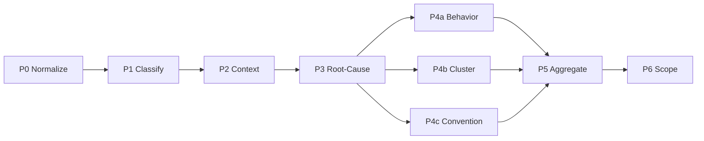

# Pipeline

Blackbox runs a 9-stage LLM analysis pipeline on uploaded session traces. Each stage transforms the data and passes it to the next. Stages P4a, P4b, and P4c run in parallel after P3.

## Stages

### P0 — Normalize

Parses uploaded JSONL files into `NormalizedMessage` format. Counts messages per session and stores metadata.

**Output:** normalized sessions with message counts.

### P1 — Classify

Labels each user message using an LLM. Batches run concurrently.

**Classifications:**

| Label | Meaning |
|-------|---------|
| `question` | Asking how to do something |
| `new_task` | Requesting new work |
| `correction` | Fixing AI output |
| `failure_report` | Reporting bugs/errors |
| `acceptance` | Accepting AI work |
| `abandonment` | Giving up on task |

**Batch size:** 100 messages per LLM call.

### P2 — Context

Builds context windows around trigger turns (messages classified as corrections, failure reports, or abandonment). Extracts surrounding messages to give the LLM enough context for root-cause analysis.

### P3 — Root-Cause Analysis

LLM analyzes each trigger window and identifies:

- Root cause category (`missing_context`, `wrong_approach`, etc.)
- Severity (1–5)
- `agents_md_rule` suggestion

### P4a — Behavior

Classifies findings by rule type and confidence.

**Batch size:** 5 findings per LLM call.

### P4b — Cluster

Groups similar findings into patterns. Distinguishes recurring issues from one-offs.

**Batch size:** 30 findings per LLM call.

### P4c — Convention

Identifies anti-patterns with `dont_do` / `do_instead` pairs.

**Batch size:** 10 findings per LLM call.

### P5 — Aggregate

Deduplicates findings within the same session (SequenceMatcher threshold 0.6), scores severity distribution, and filters to recurring findings only.

### P6 — Scope

Maps findings to repositories and developer-repo pairs for ownership attribution.

## Retry logic

All LLM calls use 2 retries with exponential backoff. If a stage fails after retries, it is marked `error` and downstream stages skip it.

## Data flow between stages

| From | To | Data |
|------|-----|------|
| P0 | P1 | `list[NormalizedMessage]` per session |
| P1 | P2 | Classified messages with labels |
| P2 | P3 | Trigger windows (message slices) |
| P3 | P4a/b/c | Raw findings with category + severity |
| P4a/b/c | P5 | Enriched findings |
| P5 | P6 | Deduplicated recurring findings |
